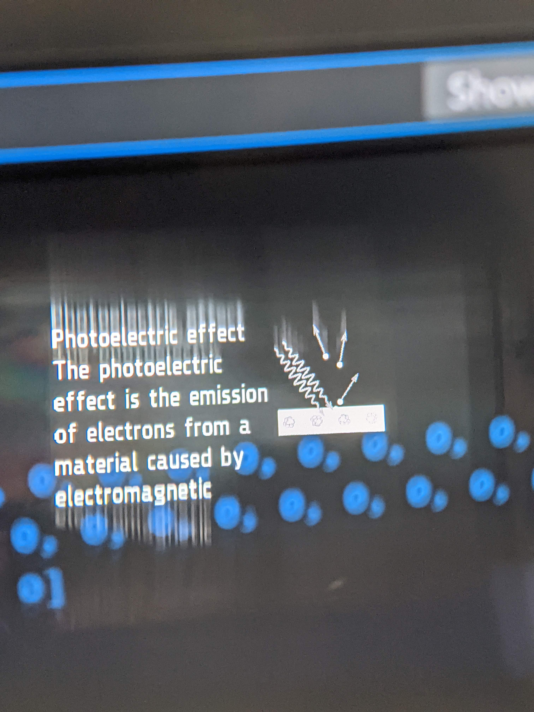

# Wikipedia Search

Listens for a search phrase from the user, queries Wikipedia using its [API](https://www.mediawiki.org/wiki/API:Main_page) and returns an extract and a thumbnail (if it exists) for display in Frame.

Tested on Android, but should be able to work on iOS also.

Flutter package `speech_to_text` uses platform-provided speech to text capability, apparently either on-device or cloud-based (although here we request `onDevice`). It uses the system microphone, which will be either the phone or possibly a connected bluetooth headset, but unless/until Frame could be connected as a bluetooth mic, it can't be used as we can't feed its streamed audio into the platform speech service.
Alternatives that can be fed streamed audio bytes include Vosk, but that is Android-only.

Times out after 5s on my Android device (`speech_to_text` allows different timeouts to be requested.)

Thumbnails are presently quantized to 4-bit (16 colors) and dithered using the [Dart image package](https://pub.dev/packages/image) and displayed progressively.

### Frameshots

### Framecast

https://github.com/user-attachments/assets/4a376e02-7350-43e5-9e96-b1d62d0912fd

https://github.com/user-attachments/assets/6e0a189c-0ad4-4f41-be7d-321ae313c6d3

### Screenshots

### Architecture

